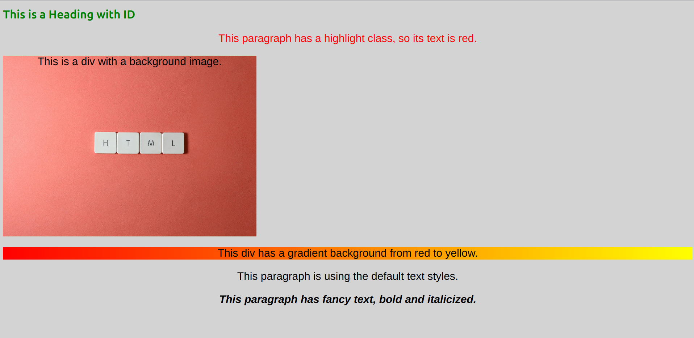

# Selector | Color | Background | Text Styling

This project demonstrates how to use CSS selectors to style HTML elements, change text color, set background styles, and customize text formatting. It includes separate HTML and CSS files to showcase best practices for styling web pages.

## Files in this Project

- **`index.html`**: Contains the structure of the web page, including elements like headings, paragraphs, and divs.
- **`styles.css`**: Contains the CSS to style the HTML elements, including selectors for color, background, and text styling.

## Features

1. **CSS Selectors**: This project uses various CSS selectors (element, class, and ID) to style HTML elements.
2. **Text Color**: Demonstrates how to change the color of text using the `color` property.
3. **Background Styling**: Demonstrates how to style backgrounds with color, images, and gradients.
4. **Text Formatting**: Demonstrates how to apply font styles, sizes, and text alignment.

## Getting Started

1. **Clone this repository** or download the files.
2. Open the `index.html` file in your browser to view the example.
3. The styles are applied from the linked **`styles.css`** file.

## HTML Structure

The HTML structure includes several elements with specific classes, IDs, and content:

```html
<!DOCTYPE html>
<html lang="en">
<head>
    <meta charset="UTF-8">
    <meta name="viewport" content="width=device-width, initial-scale=1.0">
    <title>Selector|color|Background|Text</title>
    <link rel="stylesheet" href="styles.css">
</head>
<body>

    <h1 id="main-heading">This is a Heading with ID</h1>
    
    <p class="highlight">This paragraph has a highlight class, so its text is red.</p>
    
    <div class="background-image">
        <p>This is a div with a background image.</p>
    </div>
    
    <div class="gradient-background">
        <p>This div has a gradient background from red to yellow.</p>
    </div>
    
    <p>This paragraph is using the default text styles.</p>

    <p class="fancy-text">This paragraph has fancy text, bold and italicized.</p>

</body>
</html>
```
## CSS Styling
The CSS in styles.css demonstrates the following concepts:

- `Selectors`: Targeting HTML elements by tag name, class, or ID.

- `Color`: Changing text color using the color property.

- `Backgrounds`: Applying background colors, images, and gradients.

- `Text Styling`: Customizing fonts, sizes, and text alignment.

 ```css
 /* CSS Selector */

/* Example: Targeting a specific HTML element by tag name */
h1 {
    color: blue;     /* This changes the text color of all <h1> elements to blue */
}

/* Example: Targeting a specific element by class name */
.highlight {
    color: red;    /* This changes the text color of elements with the class "highlight" to red */
}

/* Example: Targeting a specific element by id */
#main-heading {
    color: green;   /* This changes the text color of the element with id "main-heading" to green */
}

/* CSS Background */
/* You can set the background of an element, such as a color, image, or gradient */

body {
    background-color: lightgray; /* This sets the background color of the entire page to light gray */
}

/* Example: Using a background image */
.background-image {
    background-image: url('https://images.pexels.com/photos/2882568/pexels-photo-2882568.jpeg?auto=compress&cs=tinysrgb&w=1260&h=750&dpr=2');    /* This sets a background image for elements with class "background-image" */
    width:  700px;
    height: 500px;
    background-size: cover;             /* Ensures the background image covers the entire element */
}

/* Example: Using a gradient as a background */
.gradient-background {
    background: linear-gradient(to right, red, yellow); /* This creates a gradient background from red to yellow */
}

/* CSS Text */
/* You can also style text such as font size, family, alignment, etc. */

p {
    font-family: Arial, sans-serif;     /* This sets the font of all <p> elements to Arial */
    font-size: 30px;                    /* This sets the font size of all <p> elements to 16px */
    text-align: center;                 /* This aligns the text of all <p> elements to the center */
}

/* Example: Styling text with bold and italic */
.fancy-text {
    font-weight: bold;        /* Makes the text bold */
    font-style: italic;       /* Makes the text italic */
}
```
# My Project

This is an example of a project with an image.

## Screenshot

Here is a screenshot of my project:




